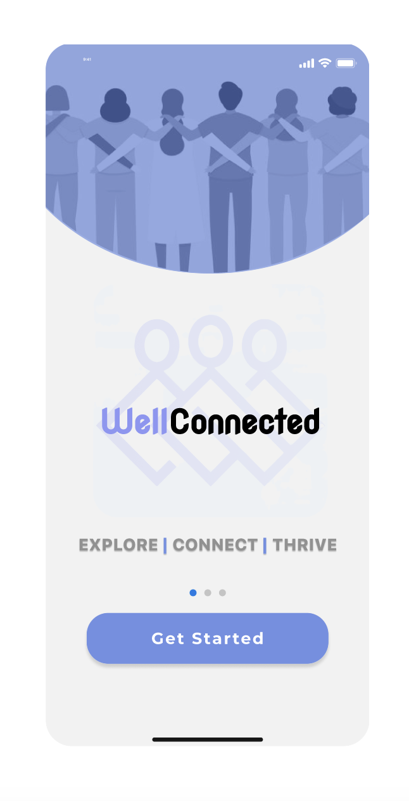
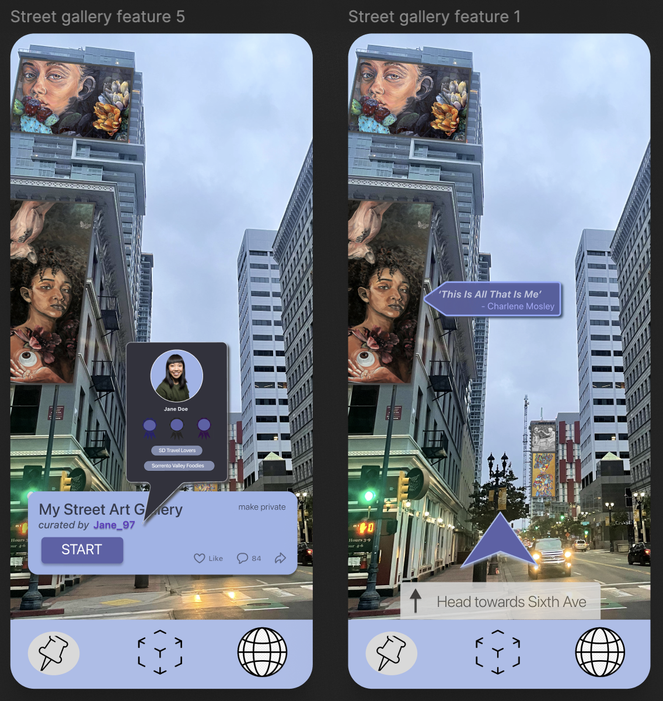
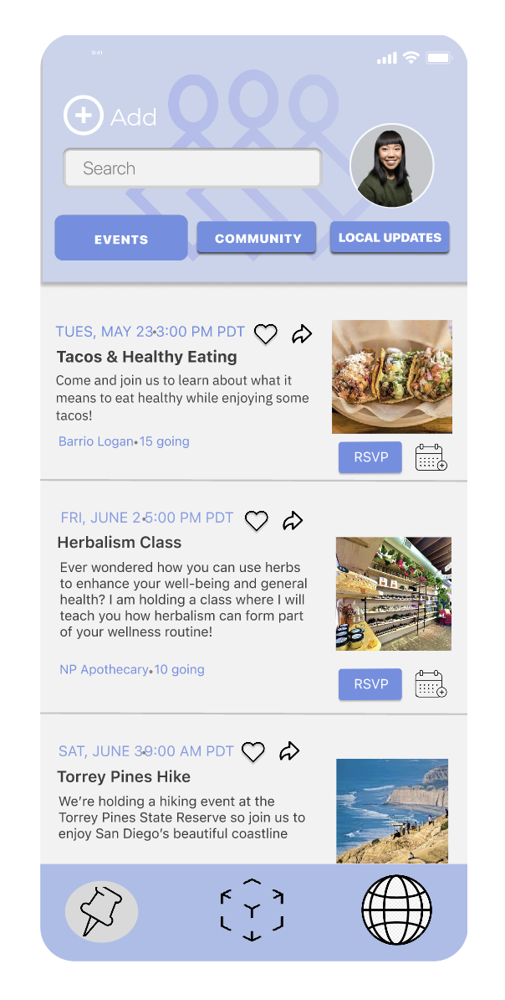

# 🎨 Resilient Health App (Figma Prototype)  

This project explores a **health app that promotes social connectivity and wellness** through **augmented reality interactions**. Designed as part of a **UCSD Design Lab project**, this prototype focuses on an **intuitive, seamless user experience**.

## 🚀 Project Overview  
- **Goal:** Improve social engagement and mental wellness through an interactive digital experience.  
- **Tools Used:** **Figma, UX Research, AR Prototyping**  
- **Supervised By:** **Eliah Aronoff-Spencer (UCSD Design Lab - Center for Health Design)**  

## 🎯 Interactive Prototype  
Click below to view the **live Figma prototype**:  

[](https://www.figma.com/proto/OzzEwvqOQqWVxLGLbBaLFb/Resilient-Health-Design---Agency-D-team-library?type=design&node-id=2348-276&t=B5iqeuPqXZMbb5qp-1&scaling=contain&page-id=0%3A1&starting-point-node-id=2348%3A276)

---

## 📸 UI Screenshots  
Here’s a preview of the app interface:  

  
  
  

---

## 📺 Repository Structure  
```
/resilient-health-app
│── screenshots/  # Contains UI images
│── README.md  # Project documentation
```

---
